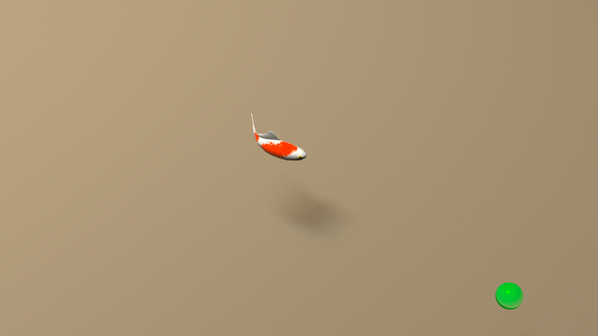
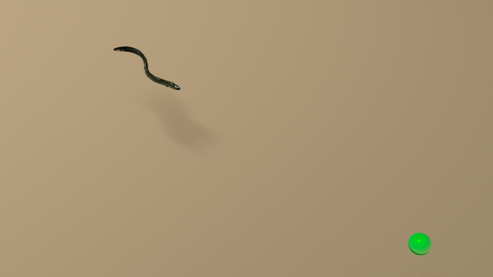
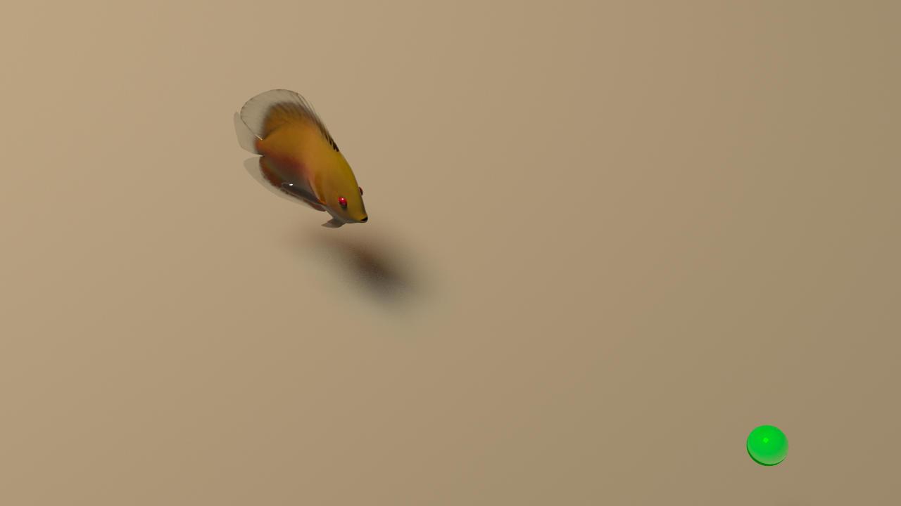
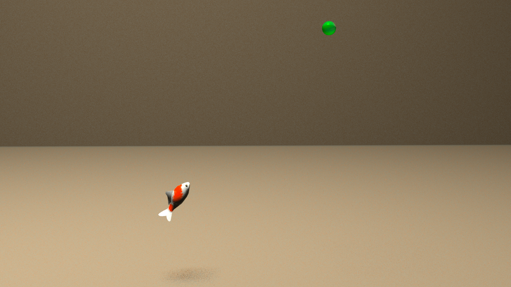
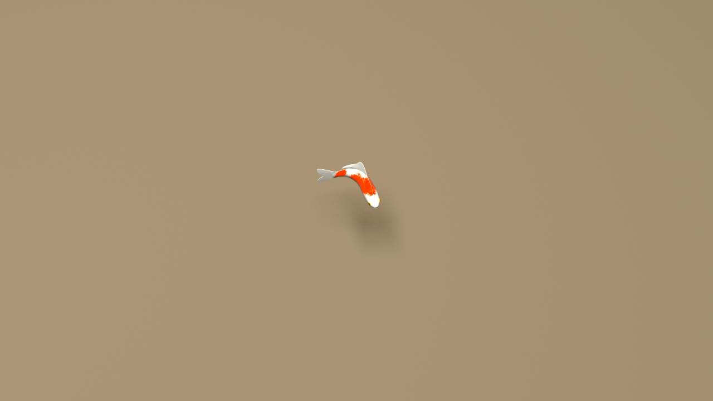
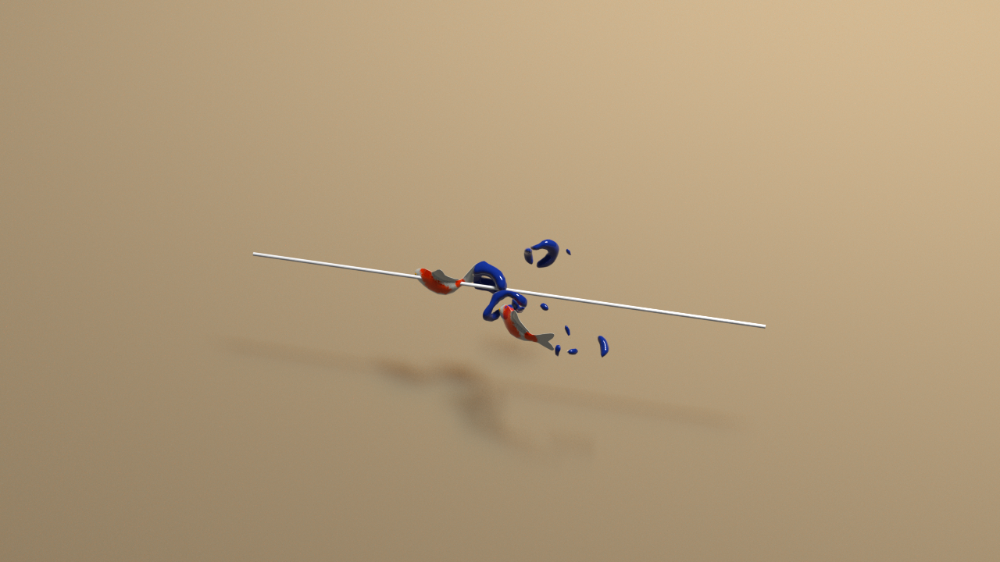
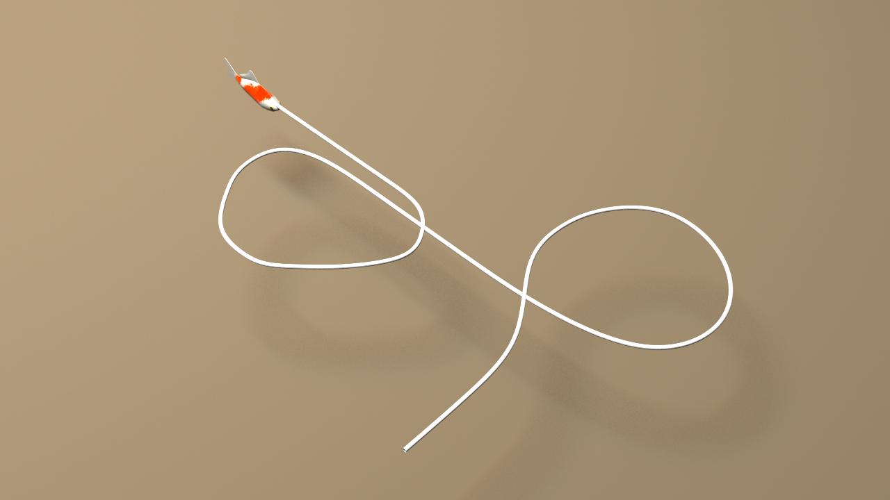
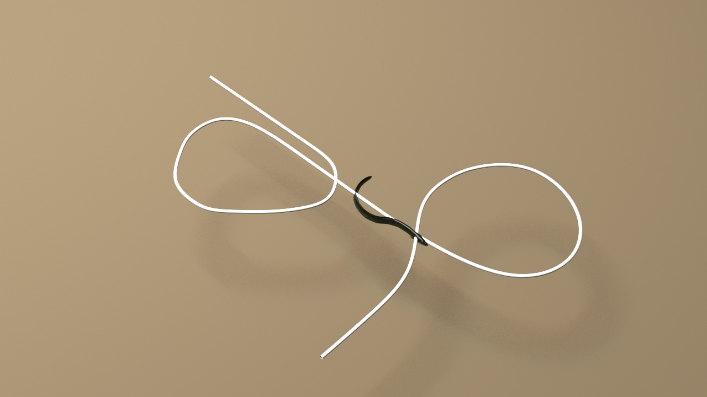
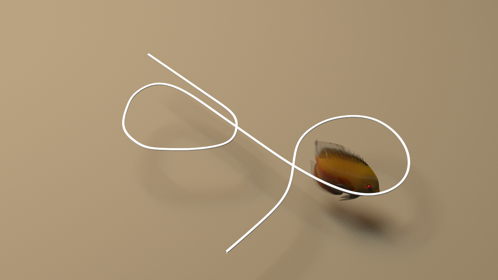

Enviroments
=============================
We propose four benchmark tasks that will be trained using RL.

4 tasks (Cruising, Pose control, Two-fish schooling, Path following).
3 underwater robots (koi, eel, flat-fish).

Cruising
--------
The robot fish tries to swim to reach a given
target location that is a distant away from the robot.

``koi-cruising-v0``, ``eel-cruising-v0`` , ``flatfish-cruising-v0`` , ``koi-cruising3d-v0``

   koi-cruising-v0

   eel-cruising-v0

   
   flatfish-cruising-v0

   
   koi-cruising3d-v0

Pose control
------------
The robot fish tries to control its pose in
order to make a U-turn.

``fish-pose-control-v0``

   fish-pose-control-v0

 

Two-fish schooling
------------------------
A robot fish follows a leader fish as closely as possible, where the leader fish is controlled to swim in a straight path. 

``fish-schooling-v0``

   fish-schooling-v0

Path following
---------------
A robot fish follows a given arbitrary path as closely and efficiently as possible.

``koi-path-v0``, ``eel-path-v0`` , ``flatfish-path-v0`` 

   koi-path-v0

   eel-path-v0

   
   flatfish-path-v0
